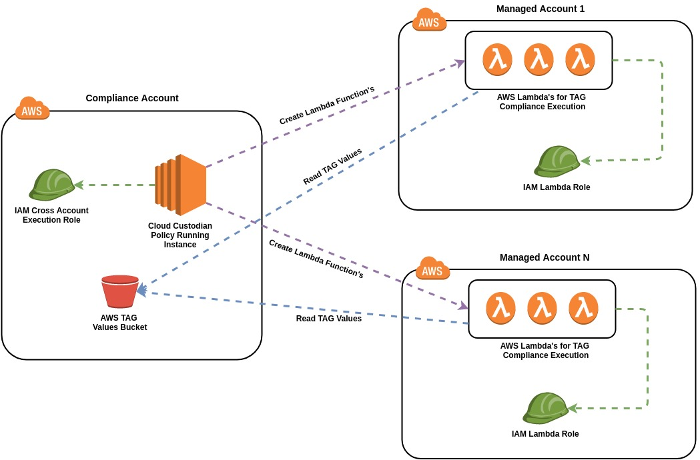

#How to manage AWS Resources with TAG Compliance?

### Do you need to implement tag compliance for multiple AWS accounts with stateless rule engine? This Page is for you. 

Reading Time: 10 Minutes

#### About Cloud Custodian 
Cloud Custodian is one of the popular options for automating security, compliance, and cost management solutions in the public cloud. 
It uses a stateless rule engine which makes its implementation easier and we don't need to maintain any servers for it.
This is an open-source project sponsored by Capital One and we can find more information about tools [here](https://cloudcustodian.io/docs/index.html).

##### AWS multi-account with Cloud Custodian 

I consider to have a central security and compliance AWS account and we manage other accounts from there. 




##### How it Works 
    1) The compliance account is the central account where the security team managing the cloud custodian policies and TAG values in version control system.
    2) The EC2 instance is used to execute Cloud Custodian tool (c7n-org) from central place.
    3) Execution of Cloud Custodian tool create AWS Lambda Functions and AWS Cloud Watch Event Rules to execute TAG Complaince for multiple AWS services like EC2, ASG, RDS, etc.
    4) Lambda Function will be triggered priodically to enforce TAG Compliance on resources and take a appropriate action. 
    5) Function will read the TAG values from Central Account S3 buckets.


##### Cross-account implementation walkthrough


**Prerequisite**

1. Create IAM Role for Cloud-Custodian EC2 Instance (I have given the EC2, Lambda, STS Access).

2. Create an EC2 instance with Cloud-Custodian IAM Role.

3. Install Cloud Custodian Tool and other packages on an EC2 instance.
```
$ sudo yum update
$ sudo pip install python-pip
$ sudo pip install custodian
$ sudo pip install c7n-org
$ sudo pip install awscli
$ sudo pip install --ignore-installed pyYAML==4.2b4
$ sudo pip install --ignore-installed botocore==1.12.94
```


**Prepare for Cross-Account**

Create IAM role for Lambda with appropriate permissions to manage AWS Service and in the trust relationships put entry for central account id<44444444444>.
I have given EC2, Lambda, RDS Access to IAM Role. 

**Create Cloud Custodian Accounts list**

The example below for AWS Managed Accounts list and you can find more details in the official documentation [here](https://cloudcustodian.io/docs/tools/c7n-org.html)
Accounts list is used by a cloud custodian tool to create resources in those accounts like lambda functions and cloud watch event rules.

```
<< accounts.yml
accounts:
  - account_id: '111111111111'
    name: <account name>
    regions:
    - <aws region>
    role: arn:aws:iam::111111111111:role/cloudcustodian-role
    tags:
    - type:<account-type - prod | dev>
    - division: <company division>

  - account_id: '222222222222'
    name: <account name>
    regions:
    - <aws region>
    role: arn:aws:iam::222222222222:role/cloudcustodian-role
    tags:
    - type:<account-type - prod | dev>
    - division: <company division>
```
**Note :** Text enclosed with < > replace with appropriate value

**Create Cloud Custodian Policy**

The example below is for AWS EC2 instances TAG compliance, we can extend it easily for other AWS Services like RDS, ASG, Lambda Function, etc.

```
<< policy.yml
vars:
  bad-tag-filter: &bad-tags
        - "tag:Name": empty
        - "tag:owner": empty
        - "tag:purpose": empty
        - type: value
          key: tag:project
          op: not-in
          value_from:
            url: s3://< Bucket Name>/project_list.txt
            format: txt
        - type: value
          key: tag:teamname
          op: not-in
          value_from:
            url: s3://< Bucket Name>/teamname_list.txt
            format: txt
        - type: value
          key: tag:environment
          op: not-in
          value: [development, production]
  good-tag-filter: &good-tags
        - "tag:Name": not-null
        - "tag:owner": not-null
        - "tag:purpose": not-null
        - type: value
          key: tag:project
          op: in
          value_from:
            url: s3://< Bucket Name>/project_list.txt
            format: txt
        - type: value
          key: tag:teamname
          op: in
          value_from:
            url: s3://< Bucket Name>/teamname_list.txt
            format: txt
        - type: value
          key: tag:environment
          op: in
          value: [development, production]
          
policies:
- name: ec2-tag-compliance-stop
  description: |
    Stops ec2 resources that do not meet tag compliance policies
  resource: ec2
  mode:
    type: periodic
    schedule: rate(10 minutes)
    role: arn:aws:iam::{account_id}:role/cloudcustodian-role
    tags:
      project: devops
      teamname: devops
  filters:
    - State.Name: running
    - SpotInstanceRequestId: null
    - "tag:aws:autoscaling:groupName": absent
    - type: value
      key: tag:Name
      op: not-equal
      value: "Packer Builder"
    - or: *bad-tags
  actions:
    - type: stop
    - type: tag
      key: tags_not_compliant
      value: https://www.example.com/AWS+Resource+Tagging

- name: ec2-tag-compliance-remove-tag
  description: |
    Removes tags_not_compliant tag on ec2 resources that meet tag compliance policies
  resource: ec2
  mode:
    type: periodic
    schedule: rate(10 minutes)
    role: arn:aws:iam::{account_id}:role/cloudcustodian-role
    tags:
      project: devops
      teamname: devops
  filters:
    - "tag:aws:autoscaling:groupName": absent
    - "tag:tags_not_compliant": present
    - and: *good-tags
  actions:
    - type: remove-tag
      tags: [tags_not_compliant]

- name: ec2-tag-compliance-terminate
  description: |
    Terminates ec2 resources that do not meet tag compliance policies
  resource: ec2
  mode:
    type: periodic
    schedule: rate(30 minutes)
    role: arn:aws:iam::{account_id}:role/cloudcustodian-role
    tags:
      project: devops
      teamname: devops
  filters:
    - State.Name: stopped
    - "tag:aws:autoscaling:groupName": absent
    - "tag:tags_not_compliant": present
    - type: instance-age
      op: gt
      days: 2
    - or: *bad-tags
  actions:
    - type: terminate
      force: true
``` 

**Note :** Text enclosed with < > replace with appropriate value


**Execute Cloud Custodian**

1. SSH to Cloud Custodian EC2 Instance
2. Check if policies are correct or not using dry run and verify the output
```
$ c7n-org run -c accounts.yml -s output -u policy.yml --dryrun
```
3. Run Cloud Custodian, it will create appropriate resources
```
$ c7n-org run -c accounts.yml -s output -u policy.yml
``` 

4. Check if resources like lambda function and cloud watch rules are created or not. 